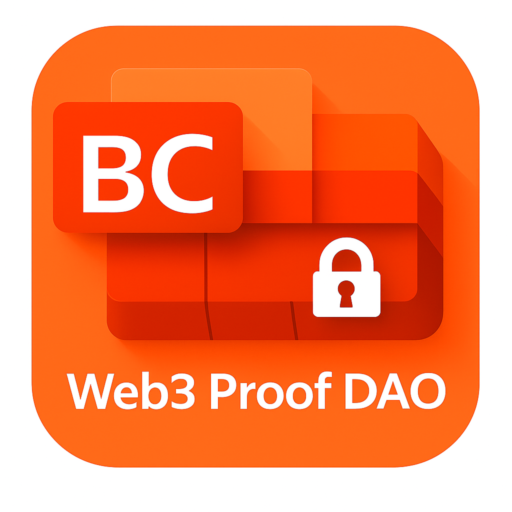

# Web3 Proof DAO 公式アイコン体系

本ページは、Web3 Proof DAO の公式配布アイコンを管理・公開する一覧です。  
**ファイルはすべて `public/` 配下**にあります。各画像はサムネイルの下に正確なファイル名を明記します。

---

## 📘 目次
1. [メインアイコン（Official Main Icon）](#1-メインアイコンofficial-main-icon)
2. [サブアイコン（Sub Icons）](#2-サブアイコンsub-icons)
　- [ハート＆翼バリエーション](#21-ハート翼別配色バリエーション)
　- [BCロックシンボル（カラー別）](#22-bcblockchainロックシンボルカラー別)
3. [画像の取り扱いポリシー](#3-画像の取り扱いポリシー要点)
4. [バージョン管理メモ](#4-バージョン管理メモ)

---

## 1. メインアイコン（Official Main Icon）

- **正式名称**: Main Icon  
- **ファイル名**: `IMG_4723.JPG`  
- **用途**: 公式サイト・公開資料の第一表示、SNS プロフィール、告知用サムネイルの既定  
- **備考**: オレンジ基調＋青翼のハート（公式）

---

## 2. サブアイコン（Sub Icons）

### 2-1. ハート＆翼（別配色バリエーション）

  
  

- **ファイル名**  
  - `IMG_4719.jpeg`（赤系・金翼バリエーション）  
  - `IMG_4726.jpeg`（別配色バリエーション）

- **推奨用途**: 告知画像の差し替え、企画別のテーマカラー展開、SNS 投稿のシリーズ差別化

---

### 2-2. BC（Blockchain）ロック・シンボル（カラー別）

  
  
  

- **ファイル名**  
  - `948503B2-9131-436B-A955-F1FCB3AA584C.png`（レッド）  
  - `E23A1E01-00DB-4BA3-93BD-ECD940B41009.png`（ブルー）  
  - `E7FAACFB-2154-4698-9666-DBAA8BDA1B604.png`（グリーン）

- **推奨用途**: 章別／機能別の識別子、資料内の見出しピクト、SNS 投票・比較用

---

## 3. 画像の取り扱いポリシー（要点）
- **改変禁止**（トリミング・彩度調整など軽微なリサイズ以外は不可）  
- **再配布は要連絡**（DAO 内での共有は可／外部配布は管理者承認）  
- **用途明記**（公開物には “Web3 Proof DAO 公式アイコン” 表記を推奨）

---

## 4. バージョン管理メモ
- 2025-10-31: 初版作成。メインアイコン `IMG_4723.JPG` を正式採用。  
- 2025-10-31: サブアイコン（ハート＆翼バリエーション／BCロック3色）を登録。
